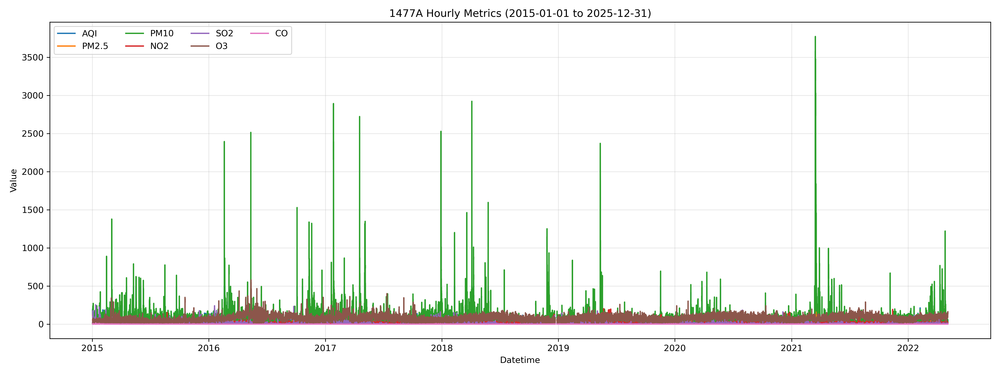
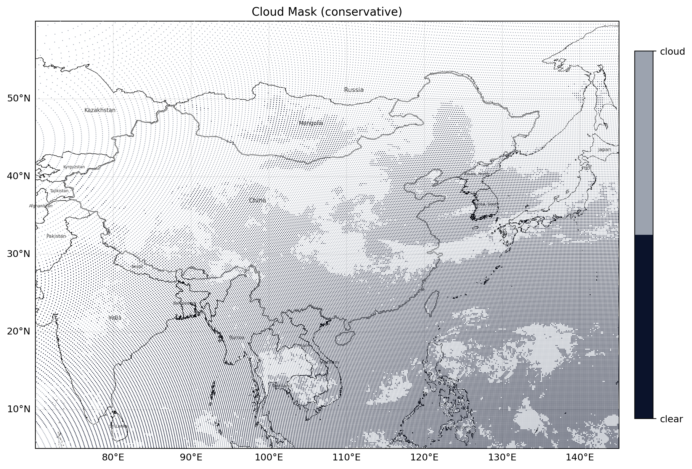
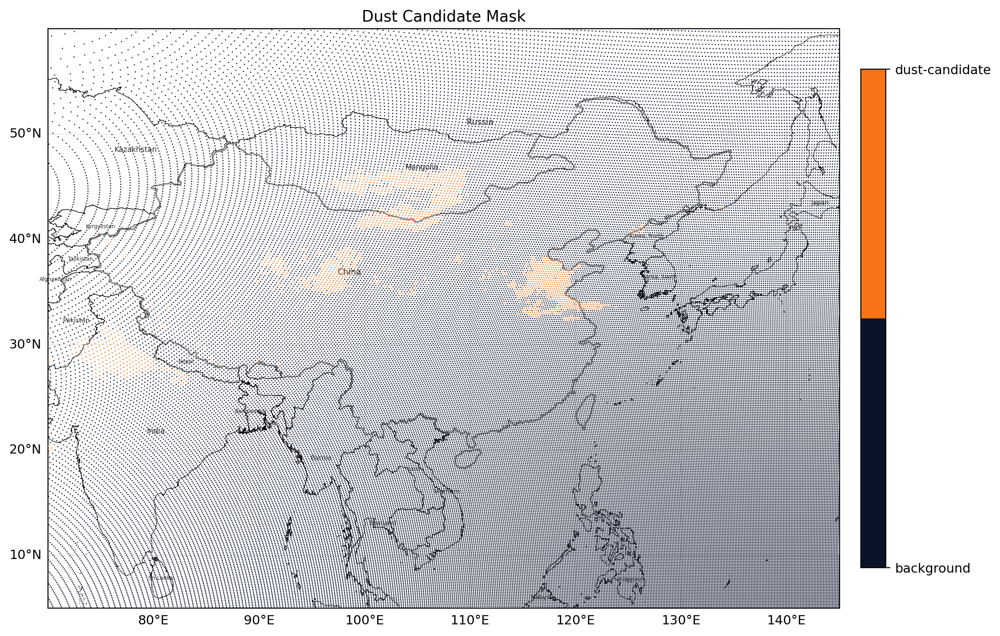

# Sand-and-Dust-Events-and-Human-Health

**A methodological playbook for event-based exposure engineering, epidemiological/causal analysis, and ML-driven decision support for sand and dust storm (SDS) health risks.**

This repository is designed as a **research framework** rather than a single “one-click” model. It provides:

- A reproducible **data + alignment** blueprint (time/space harmonization).
- Standard **SDS event analytics** outputs (binary event label + footprint + intensity metrics).
- A menu of **health-risk estimation** methods (GAM/DLNM, causal inference, ML).
- Optional **decision-support** ideas based on rehearsal learning (Grad-RH, AUF-MICNS).

> Target use cases: daily/weekly health surveillance, early warning, mechanism-informed hypothesis testing, and policy-oriented scenario analysis.

---

## Table of contents

- [Sand-and-Dust-Storms-and-Human-Health](#sand-and-dust-storms-and-human-health)
  - [Table of contents](#table-of-contents)
- [Preview](#preview)
  - [MERRA-2, CNEMC, and Himawari Event Visuals (2021-03-16 Focus)](#merra-2-cnemc-and-himawari-event-visuals-2021-03-16-focus)
    - [Dataset Collection and Preprocessing Progress (Snapshot: 2026-02-26)](#dataset-collection-and-preprocessing-progress-snapshot-2026-02-26)
    - [Key Demonstration Figures (8-Panel Closed Loop)](#key-demonstration-figures-8-panel-closed-loop)
    - [Figure Notes (What Each Figure Demonstrates)](#figure-notes-what-each-figure-demonstrates)
    - [Extension Status Beyond Event 4 (Event 16 Mention Only)](#extension-status-beyond-event-4-event-16-mention-only)

<!-- End Preview TOC block -->

- [1. Repository goals](#1-repository-goals)
  - [1.1 Problem statement](#11-problem-statement)
  - [1.2 Event-first philosophy](#12-event-first-philosophy)
- [2. Data architecture](#2-data-architecture)
  - [2.1 Core datasets and typical formats](#21-core-datasets-and-typical-formats)
  - [2.2 Temporal alignment](#22-temporal-alignment)
  - [2.3 Spatial alignment](#23-spatial-alignment)
- [3. Exposure engineering for SDS](#3-exposure-engineering-for-sds)
  - [3.1 Event object (recommended data model)](#31-event-object-recommended-data-model)
  - [3.2 Dust vs. non-dust PM separation](#32-dust-vs-non-dust-pm-separation)
- [4. Health-risk modeling](#4-health-risk-modeling)
  - [4.1 Generalized Additive Models (GAM)](#41-generalized-additive-models-gam)
  - [4.2 Distributed Lag Nonlinear Models (DLNM)](#42-distributed-lag-nonlinear-models-dlnm)
  - [4.3 Multi-site analysis](#43-multi-site-analysis)
- [5. Causal inference modules](#5-causal-inference-modules)
- [6. Machine learning modules](#6-machine-learning-modules)
  - [6.1 Exposure modeling (high-resolution dust surfaces)](#61-exposure-modeling-high-resolution-dust-surfaces)
  - [6.2 Risk prediction and classification (TabPFN as a fast baseline)](#62-risk-prediction-and-classification-tabpfn-as-a-fast-baseline)
- [7. Decision support: rehearsal learning](#7-decision-support-rehearsal-learning)
  - [7.1 Grad-RH (gradient-based nonlinear rehearsal learning)](#71-grad-rh-gradient-based-nonlinear-rehearsal-learning)
  - [7.2 AUF-MICNS (avoiding undesired future with minimal cost under non-stationarity)](#72-auf-micns-avoiding-undesired-future-with-minimal-cost-under-non-stationarity)
- [8. Recommended minimal variable set](#8-recommended-minimal-variable-set)
- [9. Evaluation, diagnostics, and reproducibility](#9-evaluation-diagnostics-and-reproducibility)
- [10. Data resources (links + formats)](#10-data-resources-links--formats)
- [11. References \& Review](#11-references--review)

---

<!-- ## Repository structure

Current top-level layout (quick orientation):

```text
.
├─ README.md
├─ data_prep/
│  ├─ mapbase/
│  │  ├─ *.py                      # map-generation and labeling scripts
│  │  ├─ *.png                     # exported base maps / labeled maps
│  │  ├─ *.shp, *.shx, *.dbf, *.prj
│  │  ├─ geoBoundaries-CHN-ADM0-all/
│  │  ├─ geoBoundaries-CHN-ADM1-all/
│  │  ├─ geoBoundaries-CHN-ADM2-all/
│  │  ├─ geoBoundariesCGAZ_ADM0/
│  │  └─ geoBoundariesCGAZ_ADM1/
│  └─ webcrawler/
│     ├─ zonghe.py                 # crawler/processing script
│     ├─ vision.html               # web page/template artifact
│     └─ lanzhou_*.csv             # crawled Lanzhou datasets
└─ .idea/                          # local IDE metadata (optional)
``` -->


---
## Preview
### MERRA-2, CNEMC, and Himawari Event Visuals (2021-03-16 Focus)

#### Dataset Collection and Preprocessing Progress (Snapshot: 2026-02-26)

- MERRA-2 ROI hourly extraction produced `8760` rows (`2021-01-01 08:30` to `2022-01-01 07:30`, local UTC+8), with `25` detected dust events and `559` event hours.
- Event 4 cross-source focus window is `2021-03-16 00:30` to `2021-03-16 18:30` local (`19 h`).
- AQ-MERRA daily alignment generated `365` rows for `2021-01-01` to `2021-12-31`.
- CNEMC NetCDF consolidation currently includes `2030` sites and `15` pollutant variables, built from `4285` scanned daily files, with coverage extended to `2026-02-14`.
- Himawari collocation snapshot at `2021-03-16 04:00 UTC` includes `1738` collocated valid PM10 sites, with Spearman `PM10 vs BTD15-13 = 0.409` and `PM10 vs DLI = 0.511`.

#### Key Demonstration Figures (8-Panel Closed Loop)

<table>
  <tr>
    <td align="center"><strong>CNEMC National PM10/PM2.5 Snapshot (2021-03-16 04:00)</strong></td>
    <td align="center"><strong>MERRA-2 Event 4 AOT Diagnostics (Mean + Time-Integrated, 2x2)</strong></td>
  </tr>
  <tr>
    <td></td>
    <td></td>
  </tr>
  <tr>
    <td align="center"><strong>MERRA-2 Event 4 Mass Diagnostics (Mean + Time-Integrated, 2x2)</strong></td>
    <td align="center"><strong>CNEMC Site 1477A Long-Range Metrics (2015-01-01 to 2025-12-31)</strong></td>
  </tr>
  <tr>
    <td></td>
    <td></td>
  </tr>
  <tr>
    <td align="center"><strong>Himawari Dust RGB (Fixed Ranges)</strong></td>
    <td align="center"><strong>Himawari Conservative Cloud Mask</strong></td>
  </tr>
  <tr>
    <td></td>
    <td></td>
  </tr>
  <tr>
    <td align="center"><strong>Himawari Dust Candidate Mask</strong></td>
    <td align="center"><strong>Himawari Dust RGB + Station PM10 Overlay</strong></td>
  </tr>
  <tr>
    <td></td>
    <td></td>
  </tr>
</table>

#### Figure Notes (What Each Figure Demonstrates)

1. **CNEMC national PM10/PM2.5 snapshot:** source is CNEMC station NetCDF at one hour; preprocessing stage is hourly slice + valid-station filtering + mapped projection; this shows station-level spatial concentration patterns but cannot infer vertical dust structure or transport pathways by itself.
2. **MERRA-2 Event 4 AOT diagnostics (2x2):** source is MERRA-2 aerosol subset; preprocessing stage is event-window extraction plus mean/time-integrated aggregation for `DUEXTTAU` and `DUSCATAU`; this shows modeled optical dust burden distribution but cannot directly represent ground PM concentrations.
3. **MERRA-2 Event 4 mass diagnostics (2x2):** source is MERRA-2 aerosol subset; preprocessing stage is event-window extraction plus mean/time-integrated aggregation for `DUSMASS` and `DUCMASS`; this shows modeled mass-loading intensity and footprint but not causal health effects.
4. **CNEMC Site 1477A long-range metrics:** source is reconstructed site-level hourly table from CNEMC archives; preprocessing stage is annual invalidation plus short-gap interpolation and multi-metric paneling; this shows long-term temporal variability but cannot isolate dust-only contributions without additional separation.
5. **Himawari Dust RGB (fixed ranges):** source is Himawari-8 AHI `B11/B13/B15`; preprocessing stage is `DN -> Radiance -> BT -> fixed-range Dust RGB`; interpretation is **qualitative** for plume morphology and candidate region screening, and it cannot be treated as a PM10 concentration map.
6. **Himawari conservative cloud mask:** source is Himawari BT/BTD products; preprocessing stage is rule-based conservative cloud screening before dust diagnostics; interpretation is **qualitative QC** for where dust inference is safer, and it cannot quantify dust intensity.
7. **Himawari dust candidate mask:** source is Himawari clear-sky pixels after cloud screening; preprocessing stage is threshold-based binary candidate labeling; interpretation is **semi-quantitative screening** of likely dust footprint, but not a calibrated mass retrieval.
8. **Himawari Dust RGB + station PM10 overlay:** source is Himawari RGB field plus same-hour CNEMC PM10 station values; preprocessing stage is nearest-pixel collocation and overlay rendering; interpretation is a **semi-quantitative spatial consistency check**, not a causal attribution or inversion model.

#### Extension Status Beyond Event 4 (Event 16 Mention Only)

Beyond Event 4, Event 16 (`2021-05-30 21:30` to `2021-06-01 10:30` local, `38 h`) has already produced MERRA-2 spatial diagnostics in the repository, and is currently used as an extension-check case to verify that the same preprocessing and event-window mapping logic remains stable beyond the March 16 focus event.

---

## 1. Repository goals

### 1.1 Problem statement

We study how **SDS events** (and related dust exposure) affect human health.

We formalize a general mapping:

- **Inputs (X):** SDS exposures + meteorology + co-pollutants + population vulnerability + interventions.
- **Outputs (Y):** health outcomes (counts/rates, binary events, time-to-event), possibly subgroup-specific.
- **Constraints:** confounding, measurement error, lagged effects, spatial misalignment, non-stationarity.

### 1.2 Event Analysis

To improve comparability across studies and support downstream health models, we recommend an **event-first** workflow:

1. **Detect SDS events** (y/n label) using one or more data sources.
2. Delineate the **spatiotemporal footprint** and compute **affected-area concentration/intensity** metrics.
3. Align event metrics to health outcomes at compatible time scales (daily/weekly/monthly).
4. Estimate risks using statistical/causal/ML methods with uncertainty quantification.

---

## 2. Data architecture

### 2.1 Core datasets and typical formats

**Meteorology / reanalysis** *(NetCDF/GRIB)*
- ERA5 hourly meteorology: wind components, temperature, RH, pressure, boundary-layer variables.
- CAMS global reanalysis: aerosols (including dust-related fields).
- MERRA-2: aerosol diagnostics including dust proxies (NASA GES DISC).

**Remote sensing** *(HDF/GeoTIFF)*
- MODIS MAIAC AOD (daily, ~1 km) for plume/footprint detection and exposure proxies.
- AERONET: ground-truth optical properties for AOD validation.

**Air quality stations** *(CSV/JSON/Parquet)*
- PM10/PM2.5 from national networks and open platforms (e.g., OpenAQ).

**Health outcomes** *(CSV; frequently access-restricted)*
- Daily/weekly: mortality, hospital admissions/ER visits, ambulance calls.
- Notifiable infectious disease surveillance (e.g., measles cases).

### 2.2 Temporal alignment

**Recommended default:** daily.

- Convert hourly reanalysis → daily summaries (mean/max or event-window statistics).
- Convert event footprints → daily footprint metrics.
- Align to health time series with lag windows. If health data are weekly:
  - count SDS days per week,
  - compute weekly max/mean intensity,
  - compute cumulative intensity (sum over days).

### 2.3 Spatial alignment

Choose a spatial support consistent with health data (city/county/province).

- Grid → polygon aggregation using zonal statistics (area-weighted and/or population-weighted).
- Save both **mean** and **high-percentile** exposures within each administrative unit.

---

## 3. Exposure engineering for SDS

### 3.1 Event object (recommended data model)

For each SDS event **e**, store a structured “event object”:

- `start_time`, `end_time`
- `footprint` (polygon(s) per time step, e.g., GeoJSON)
- `intensity_metrics` (time series):
  - area-mean concentration/intensity
  - population-weighted mean (optional)
  - within-footprint percentile (e.g., P90 core)
  - footprint area
  - duration-integrated intensity (dose proxy)
- `detection_method` (visibility / PM threshold / AOD / model tracer / fusion)
- `uncertainty` (confidence score, threshold sensitivity range, source spread)

This makes SDS exposures **interoperable** with epidemiological models and supports explicit uncertainty propagation.

### 3.2 Dust vs. non-dust PM separation

Depending on data availability:

- Use dust tracers from CAMS/MERRA-2 (model-informed separation).
- Use dust fraction of AOD (algorithmic/model-based).
- Use coarse fraction proxy (PM10 − PM2.5) when both are available.

---

## 4. Health-risk modeling

### 4.1 Generalized Additive Models (GAM)

**Use case:** daily counts (mortality, admissions, disease cases).

**Canonical form** (Poisson / quasi-Poisson / negative binomial):

\[
\log(\mathbb{E}[Y_t]) = \alpha + \beta E_t + \sum_j s_j(M_{j,t}) + s_{time}(t) + \gamma^\top DOW_t + \log(pop_t)
\]

Where:
- `Y_t`: daily health outcome (count)
- `E_t`: SDS exposure (binary event, intensity, or both)
- `M_{j,t}`: meteorology and co-pollutants (smooth terms)
- `s_time(t)`: seasonality + long-term trend
- `DOW_t`: day-of-week, holiday indicators
- `log(pop_t)`: offset

**Key design parameters:**
- Spline basis, degrees of freedom for time trend & meteorology
- Overdispersion strategy
- Residual autocorrelation checks

### 4.2 Distributed Lag Nonlinear Models (DLNM)

**Use case:** SDS effects can extend across multiple days.

Design choices:
- lag window length `L` (outcome-dependent)
- exposure-response basis (linear vs spline)
- lag-response basis (spline; constrained if needed)

### 4.3 Multi-site analysis

For multi-city/province settings:
- Fit city-specific models → pool effects via random-effects meta-analysis.
- Explore heterogeneity by climate zone, dust regime, or vulnerability indices.

---

## 5. Causal inference modules

SDS–health studies are sensitive to confounding (seasonality, temperature, humidity, co-pollutants) and policy/behavior shifts.

Recommended causal tools:

- **DAG-driven adjustment sets** (structural causal reasoning).
- **Time-varying effect estimation** (seasonal regimes, policy changes).
- **Negative controls / placebo tests** to detect residual confounding.
- **Robustness/refutation tests** (when using ML-aided causal frameworks).

Practical note: causal claims require transparent assumptions. When assumptions are weak, report results as associations with careful sensitivity analyses.

---

## 6. Machine learning modules

### 6.1 Exposure modeling (high-resolution dust surfaces)

Borrow best practices from high-resolution PM modeling:

- Predict daily dust/coarse PM using remote sensing (AOD), reanalysis meteorology, CTM outputs, land-use, and surface properties.
- Use ensemble learners (e.g., random forest, gradient boosting) and validate against stations/AERONET.

### 6.2 Risk prediction and classification (TabPFN as a fast baseline)

TabPFN is a transformer trained for **small tabular classification** tasks and can serve as a fast benchmark for:

- “High-risk day” classification
- “Outbreak week” classification

Preprocessing is essential (numerical-only, missing values handled before inference).

---

## 7. Decision support: rehearsal learning

This repository also explores how **decision support** could be built on top of SDS–health models.

### 7.1 Grad-RH (gradient-based nonlinear rehearsal learning)

Conceptually:
- `X`: context (forecast SDS intensity, meteorology, mobility)
- `Z`: actionable interventions (warnings, masks, school closures, hospital staffing)
- `Y`: undesired outcomes (excess mortality, ER surge, outbreak intensity)

Grad-RH supports optimization over **multivariate interventions** in nonlinear settings.

### 7.2 AUF-MICNS (avoiding undesired future with minimal cost under non-stationarity)

Conceptually:
- sequentially updates influence relations in non-stationary environments
- selects minimal-cost interventions to keep outcomes within a desired region

**Important:** applying rehearsal learning in public health requires:
- a defensible influence graph (domain expertise)
- realistic action-cost definitions
- adequate variation in observed interventions to learn influence relations

---

## 8. Recommended minimal variable set

**Exposure (event-based):**
- SDS binary indicator
- intensity metrics (area-mean, pop-weighted mean, P90 core)
- footprint area, duration

**Air quality:**
- PM10, PM2.5, coarse fraction (PM10 − PM2.5)
- optional: O3, NO2 (mixture indicators)

**Meteorology:**
- temperature, RH, wind speed/gusts, pressure
- boundary-layer height (optional)

**Population & vulnerability:**
- age structure, SES proxies, baseline disease prevalence

**Healthcare capacity & behavior:**
- hospital beds per capita, baseline outpatient volume
- mobility proxies (optional)

**Infectious disease modifiers (if studying measles or similar):**
- vaccination coverage proxies
- school calendar, reporting changes

---

## 9. Evaluation, diagnostics, and reproducibility

**Exposure evaluation**
- Compare event detection across sources (PM vs AOD vs reanalysis) using hit rate / false alarm rate.
- Validate AOD-based products with AERONET where possible.

**Health model diagnostics**
- residual autocorrelation
- overdispersion and influential points
- sensitivity to df and lag length

**Causal robustness**
- negative controls
- alternative exposure definitions
- refutation tests (placebo treatments, randomized time shifts)

**Reproducibility**
- store event catalogs with metadata
- log preprocessing steps and QA/QC rules
- version dataset snapshots when permissible

---

## 10. Data resources (links + formats)

> The following URLs are included as practical entry points. Data access may require registration and/or acceptance of license terms.

```text
ERA5 (NetCDF/GRIB via Copernicus CDS)
https://cds.climate.copernicus.eu/datasets/reanalysis-era5-single-levels

CAMS global reanalysis (NetCDF)
https://www.ecmwf.int/en/forecasts/dataset/cams-global-reanalysis

MERRA-2 data access (NetCDF/HDF; NASA GES DISC)
https://gmao.gsfc.nasa.gov/gmao-products/merra-2/data-access_merra-2/

MODIS MAIAC AOD (HDF/GeoTIFF; also via Google Earth Engine)
https://ladsweb.modaps.eosdis.nasa.gov/missions-and-measurements/products/MCD19A2

AERONET (AOD/inversion; CSV/text)
https://aeronet.gsfc.nasa.gov/

OpenAQ API (air quality; JSON/CSV)
https://docs.openaq.org/


MODIS Deep Blue aerosol (AOD；适合亮地/沙漠；HDF，LAADS 获取入口汇总)
https://earth.gsfc.nasa.gov/climate/data/deep-blue/data

VIIRS Deep Blue aerosol L2 (AERDB_L2；NetCDF4；6 分钟粒度)
https://www.earthdata.nasa.gov/data/catalog/asips-aerdb-l2-viirs-snpp-nrt-2

OMI/Aura Near-UV Aerosol Index (AI；HDF5；尘/烟吸收性识别常用)
https://data.nasa.gov/dataset/omi-aura-near-uv-aerosol-index-optical-depth-and-single-scattering-albedo-1-orbit-l2-13x24-778ff

Sentinel-5P TROPOMI Aerosol Index (UVAI；L2；尘追踪常用)
https://data.nasa.gov/dataset/sentinel-5p-tropomi-aerosol-index-1-orbit-l2-7km-x-3-5km-v1-s5p-l2-aer-ai-at-ges-disc

CALIPSO/CALIOP L2 Aerosol Profile (廓线/垂直结构；尘层高度验证利器)
https://data.nasa.gov/dataset/calipso-lidar-level-2-aerosol-profile-v4-21-e57f0

MODIS Deep Blue dust storm frequency climatology（沙尘频次/阈值衍生产品；MYDFDS_CLM_GLB_L3）
https://data.nasa.gov/dataset/climatological-monthly-frequency-of-dust-storm-over-land-for-varying-intensities-based-on-
```

---

## 11. References \& Review

This repository builds on the environmental epidemiology and ML/causal inference literature, including (non-exhaustive):

- Manisalidis et al. (2020). *Environmental and Health Impacts of Air Pollution: A Review.*
- Wu et al. (2020). *Evaluating the impact of long-term exposure to fine particulate matter on mortality among the elderly.*
- Kang et al. (2021). *Machine learning-aided causal inference framework for environmental data analysis.*
- Han et al. (2024). *Interpretable AI-driven causal inference to uncover time-varying effects of PM2.5 and public health interventions.*
- Hollmann et al. (2023). *TabPFN: A Transformer That Solves Small Tabular Classification Problems in a Second.* arXiv:2207.01848.
- Qin, Tian, Wang, Zhou (2025). *Gradient-Based Nonlinear Rehearsal Learning with Multivariate Alterations.* (AAAI).
- Du, Qin, Wang, Zhou (2024). *Avoiding Undesired Future with Minimal Cost in Non-Stationary Environments.* (NeurIPS).

If you use this repository in academic work, please cite it and the relevant original papers.

For the part of the repository focusing on SDS science, key representative sources include:

| Theme                              | Representative sources      | Core contribution                                                                                                 |
| ---------------------------------- | --------------------------- | ----------------------------------------------------------------------------------------------------------------- |
| Global SDS coordination & warning  | WMO SDS-WAS                 | Coordinated global SDS research/forecasting network; early warning goals ([World Meteorological Organization][1]) |
| Dust atmospheric process & impacts | WMO SDS background          | Dust interacts with radiation/clouds; climate relevance ([World Meteorological Organization][2])                  |
| Dust emission physics              | Shao (dust emission scheme) | Strong dependence on friction velocity and soil factors ([geomet.uni-koeln.de][3])                                |
| Emission scheme sensitivity        | Zhao et al. (East Asia)     | Soil moisture & vegetation drive differences across schemes ([ResearchGate][4])                                   |
| Inverse constraints on dust cycle  | Kok et al. (ACP)            | Observation-constrained dust cycle reduces concentration/deposition errors ([acp.copernicus.org][5])              |
| High-resolution AOD retrieval      | MODIS MAIAC                 | Daily ~1 km AOD supports regional footprint detection ([Google for Developers][6])                                |
| Composition reanalysis             | CAMS reanalysis             | 3D time-consistent composition fields incl. aerosols ([ECMWF][7])                                                 |

[1]: https://wmo.int/site/knowledge-hub/governance/research-board/environmental-pollution-and-atmospheric-chemistry-scientific-steering-committee-ssc-epac/sand-and-dust-storms-warning-advisory-and-assessment-system?utm_source=chatgpt.com "Sand and Dust Storms Warning Advisory and Assessment System"
[2]: https://wmo.int/sds-about?utm_source=chatgpt.com "SDS about - wmo.int"
[3]: https://geomet.uni-koeln.de/fileadmin/Dokumente/Arbeitsgruppen/Meteorologie/Shao__Yaping/pdfs/Shao_2004_Simplification_dustemission_scheme.pdf?utm_source=chatgpt.com "Simplification of a dust emission scheme and comparison with data"
[4]: https://www.researchgate.net/profile/Yaping-Shao/publication/253661905_An_assessment_of_dust_emission_schemes_in_modeling_East_Asian_dust_storms/links/553b69540cf245bdd7647a7b/An-assessment-of-dust-emission-schemes-in-modeling-East-Asian-dust-storms.pdf?utm_source=chatgpt.com "jd005746 1..11 - ResearchGate"
[5]: https://acp.copernicus.org/articles/21/8127/2021/?utm_source=chatgpt.com "ACP - Improved representation of the global dust cycle using ..."
[6]: https://developers.google.com/earth-engine/datasets/catalog/MODIS_061_MCD19A2_GRANULES?utm_source=chatgpt.com "MCD19A2.061: Terra & Aqua MAIAC Land Aerosol Optical Depth Daily 1km ..."
[7]: https://www.ecmwf.int/en/forecasts/dataset/cams-global-reanalysis?utm_source=chatgpt.com "CAMS global reanalysis | ECMWF"

For the part of the repository focusing on SDS–health links, key representative sources include:

| Domain                         | Representative sources                                | What they contribute                                                                                                                                                                                                                                                                                                                                        |
| ------------------------------ | ----------------------------------------------------- | ----------------------------------------------------------------------------------------------------------------------------------------------------------------------------------------------------------------------------------------------------------------------------------------------------------------------------------------------------------- |
| Public health framing          | WHO SDS fact sheet                                    | Health impacts and mitigation framing ([World Health Organization][1])                                                                                                                                                                                                                                                                                      |
| Global evidence synthesis      | Global systematic review of dust storm health impacts | Broad categorization of short/long-term outcomes ([journals.sagepub.com][2])                                                                                                                                                                                                                                                                                |
| Microbial/infectious dimension | Systematic review on microorganisms & infections      | Evidence synthesis + geographic imbalance, limitations ([MDPI][3])                                                                                                                                                                                                                                                                                          |
| Large-scale SDS mortality      | China multi-site time-series evidence                 | Multi-cause mortality risks with SDS events ([Nature][4])                                                                                                                                                                                                                                                                                                   |
| Regional infectious case study | Dust events & measles in Gansu (Hexi–Lanzhou)         | Disease-specific SDS association in NW China ([ScienceDirect][5])                                                                                                                                                                                                                                                                                           |
| Mechanistic plausibility       | Air pollution health mechanisms review                | Size-dependent penetration; immune/inflammation pathways 【47:14†Manisalidis et al. - 2020 - Environmental and Health Impacts of Air Pollution A Review.pdf†L25-L42】【47:6†Manisalidis et al. - 2020 - Environmental and Health Impacts of Air Pollution A Review.pdf†L1-L9】                                                                                  |
| Causal/AI methods              | Time-varying causal inference; ML-aided SCM           | Interpretable, robust causal reasoning on environmental time series 【47:10†Han et al. - 2024 - Interpretable AI-driven causal inference to uncover the time-varying effects of PM2.5 and public hea.pdf†L1-L16】【148:14†Kang et al. - 2021 - Machine learning-aided causal inference framework for environmental data analysis A COVID-19 case s.pdf†L8-L30】 |

[1]: https://www.who.int/news-room/fact-sheets/detail/sand-and-dust-storms?utm_source=chatgpt.com "Sand and dust storms - World Health Organization (WHO)"
[2]: https://journals.sagepub.com/doi/pdf/10.1177/11786302211018390?utm_source=chatgpt.com "Global Health Impacts of Dust Storms: A Systematic Review"
[3]: https://www.mdpi.com/1660-4601/19/11/6907?utm_source=chatgpt.com "Infectious Diseases Associated with Desert Dust Outbreaks: A Systematic ..."
[4]: https://www.nature.com/articles/s41467-023-42530-w.pdf?utm_source=chatgpt.com "Mortality risks from a spectrum of causes associated with sand and dust ..."
[5]: https://www.sciencedirect.com/science/article/pii/S1352231017301346?utm_source=chatgpt.com "Assessment for the impact of dust events on measles incidence in ..."
