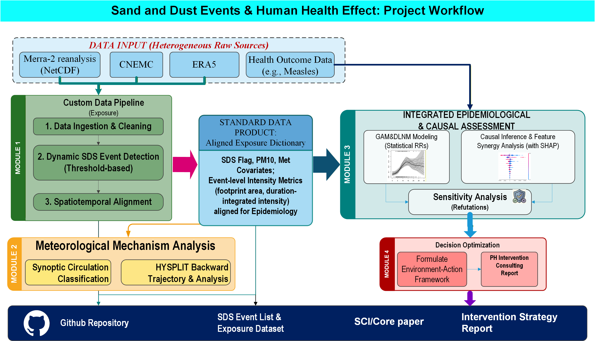
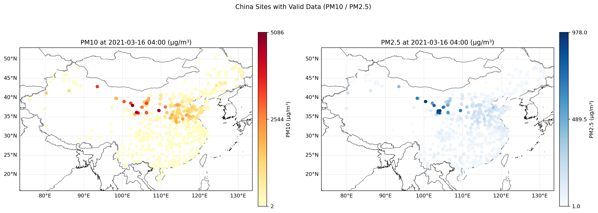
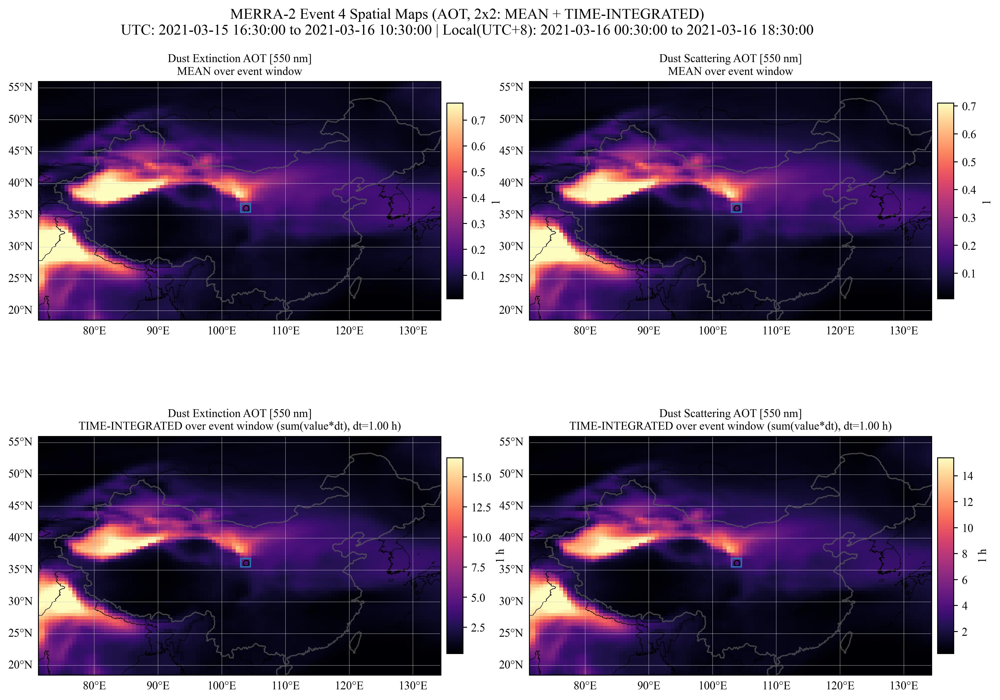
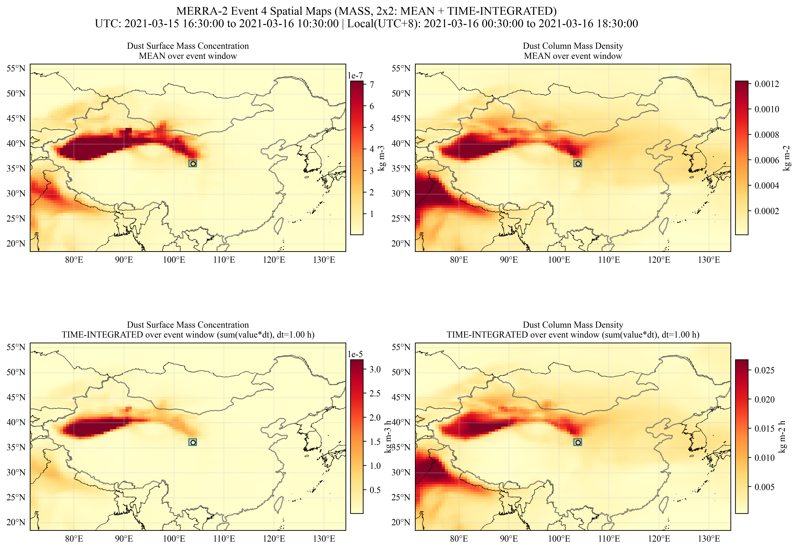

# 基于机器学习的沙尘天气-健康效应研究 
(Sand-and-Dust-Events-and-Human-Health)

**A rigorous multi-source data pipeline and machine learning-aided causal inference framework for assessing the health impacts of Sand and Dust Storms (SDS) on respiratory infectious diseases (Measles) in Northwest China (Gansu/Lanzhou).**

---

## Table of Contents

- [1. Visualizations & Analytical Workflow](#1-visualizations--analytical-workflow)
- [2. Project Framework & Core Workflows](#2-project-framework--core-workflows)
- [3. Code Structure & Usage Examples](#3-code-structure--usage-examples)
- [4. References](#4-references)

---

## 1. Visualizations & Analytical Workflow

This project maps physical SDS events through environmental exposures to epidemiological risk and causal attribution.

<table>
  <tr>
    <td align="center" width="50%"><strong>Project Analytical Workflow</strong></td>
    <td align="center" width="50%"><strong>Interactive Data Visualization Tool</strong></td>
  </tr>
  <tr>
    <td></td>
    <td style="padding: 15px;"><div align="center"><p><strong><a href="https://corerorey.github.io/Sand-and-Dust-Events-and-Human-Health/data_prep/cnemc_site_data/webcrawler/vision.html" target="_blank">Access the Web Visualizer Here</a></strong></p><p style="font-size: 0.9em; text-align: left; word-break: break-word;">Upload generated data files (e.g., <code>1477A_yuzhong_..._wide.csv</code>) to instantly visualize station timelines and extracted event windows.</p></div></td>
  </tr>
  <tr>
    <td align="center"><strong>National Ground Network ($PM_{10}$ Snapshot)</strong></td>
    <td align="center"><strong>MERRA-2 Satellite/Reanalysis AOT Diagnostics</strong></td>
  </tr>
  <tr>
    <td></td>
    <td></td>
  </tr>
  <tr>
    <td align="center"><strong>MERRA-2 Dust Mass Tracking</strong></td>
    <td align="center"><strong>Himawari-8 High-Res Dust Tracking Overlay</strong></td>
  </tr>
  <tr>
    <td></td>
    <td></td>
  </tr>
</table>

*(For a full breakdown of the data prep methodologies spanning MERRA-2, Himawari, and CNEMC, see the individual folder READMEs inside `data_prep/`).*

---

## 2. Project Framework & Core Workflows

The repository consists of two highly-decoupled pipelines.

### Part A: Exposure Data Engineering (`data_prep/`)
Focuses on converting heterogeneous raw sources into a **Standard Target Format**: A daily-aligned dataframe for any target city (e.g., Lanzhou), merging meteorology and dust spike labels.

- **MERRA-2 & ERA5:** Computes time-integrated AOT, Mass bounds, Temperature, Wind Speed, and Relative Humidity.
- **CNEMC:** Constructs high-fidelity time series from ground stations handling NaNs and site-drops.
- **Himawari & HYSPLIT:** Provide optical footprint validation and air-mass backward trajectories.

### Part B: Health & Causal Modeling (`health_modeling/`)
A three-step epidemiological and ML-assisted causal verification framework:

1. **Statistical Base Risk:** Fits a DLNM (Distributed Lag Non-linear Model via R) or a Poisson GAM to assess standard 0-14 day lagged risks of SDS events on measles.
2. **ML Synergy Discovery:** Trains a TimeSeries Cross-validated `RandomForestRegressor`. Uses `SHAP` to extract the synergistic risk pathways (e.g., discovering the exact $PM_{10} \times Temp \times RH$ thresholds).
3. **Causal Refutation:** Employs `DoWhy` and `EconML` to treat the discovered thresholds as "interventions", computing the Average Treatment Effect (ATE) while passing Placebo Treatment and Random Common Cause falsification tests.

---

## 3. Code Structure & Usage Examples

Current top-level layout layout and execution entry points:

```text
.
├─ data_prep/                       # Pipeline A: Environmental Prep 
│  ├─ cnemc_site_data/              # Scripts to pull and clean station NetCDFs/CSVs
│  │  ├─ prepro_individual.py       # (Example: runs station interpolation)
│  │  └─ webcrawler/                # HTML/JS for Github Pages deployment
│  ├─ merra-2/                      
│  ├─ era5/                         # Grid extraction mapping (t2m, d2m -> Temp, RH)
│  ├─ himawari/                     
│  └─ hysplit/                      # HYSPLIT analytical outputs & documentation
│
└─ health_modeling/                 # Pipeline B: Health Models
   ├─ health_data_loader.py         # [Bridge] Ingests and formats raw Measles CSV
   ├─ gam_baseline.py               # (Output RR base stats)
   ├─ dlnm_baseline.R               # (Outputs lagged risk surfaces)
   ├─ ml_shap_synergy.py            # (Trains RF & prints SHAP interactive thresholds)
   ├─ causal_refutation_tests.py    # (Validates DAG via robust SCM)
   └─ meta_analysis.py              # [Reserved] Meta-pooling
```

### Example Usage: Running the Health Models
Once your aligned exposure CSV is mapped internally inside `health_data_loader.py`, execute the analytical pipeline stepwise:

```bash
# Activate your conda environment 
conda activate myenv

# 1. Check statistical baselines
python health_modeling/gam_baseline.py

# 2. Extract ML risk thresholds (e.g. at what temp does dust become critical)
python health_modeling/ml_shap_synergy.py

# 3. Verify causality computationally
python health_modeling/causal_refutation_tests.py
```

---

## 4. References

[1] Lian L, et al. A comprehensive review of dust events: Characteristics, climate feedbacks, and public health risks. *Current Pollution Reports*, 2025.
[2] Zhang C, et al. Mortality risks from a spectrum of causes associated with sand and dust storms in China. *Nature Communications*, 2023.
[3] Ma Y, et al. Assessment for the impact of dust events on measles incidence in western China. *Atmospheric Environment*, 2017.
[4] Kang Q, et al. Machine learning-aided causal inference framework for environmental data analysis: A COVID-19 case study. *Environmental Science & Technology*, 2021.
[5] Peng L, et al. The effects of air pollution and meteorological factors on measles cases in lanzhou, China. *Environmental Science and Pollution Research*, 2020.
